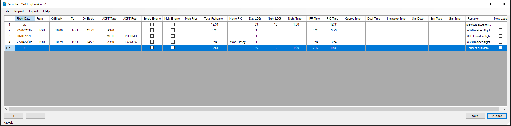
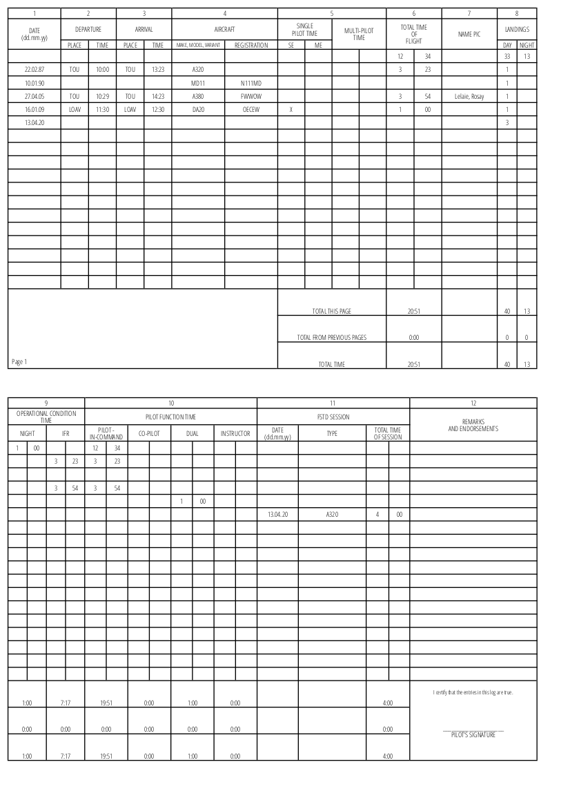

# SimpleEASALogbook
a minimalistic Logbook for Pilots

The purpose of this tool is to provide a simple not feature bloated logbook program for pilots which sticks to the logging rules of the EASA.
[logging rules of the EASA, starting ~page 30](https://www.easa.europa.eu/sites/default/files/dfu/Part-FCL.pdf)

All the advanced aspects of a flight can still be entered in the remarks field (like type of approach, pax on board, etc.), but the main purpose is to forfill all legal requirements.
Also there shall be no vendor lock-in, exporting in various formats will be supported.

## Features:
* provide logging just like onthe EASA conform paper logbook
* PDF export to an EASA conform format
* various importers (MCC PilotLog CSV export, Brussels Airlines BlueOne PDF, Lufthansa Flugstundenuebersicht PDF, ...)
* various exporters (Easa conform PDF and HTML, ...)
* runs without installation on windows

## Known bugs:
* the importers and exporters are only tested for co-pilots, since the devlopers lack the export data from captains of the supported programs. help us by providing your exports if you are a commander.
* currently linux and mac-osx are not supported. This tool runs with .net WinForms which are deprecated in mono-project and therefore buggy. Help is appreciated - see issues

## Installation:
* [Download latest release](https://github.com/ni720/SimpleEASALogbook/releases/download/0.2/SimpleEASALogbook_v0.2.zip)
* unzip to a convenient location
* Windows: .net framework should be already installed, just execute SimpleEASALogbook.exe
* Linux: install mono-framework and wkhtmltopdf, mark pdftotext as executable, then run mono SimpleEasaLogbook.exe
* Mac [untested]:[install the mono framework](https://www.mono-project.com/docs/about-mono/supported-platforms/macos/) an then in the console run mono SimpleEasaLogbook.exe

## Screenshots

EASA conform PDF export example:

